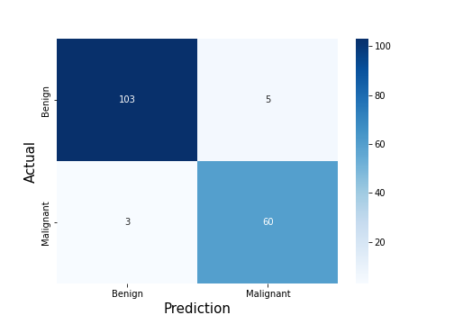

# Tumor Classification
Machine Learning model training for classification of benign and malignant tumors

## Confusion Matrix

### Random Forest Algorithm

### Logistic Regression Algorithm

## Score
|ML Algorithm|Score|
|---|---|
|Random Forest|95.32%|
|Logistic Regression|98.25%|
